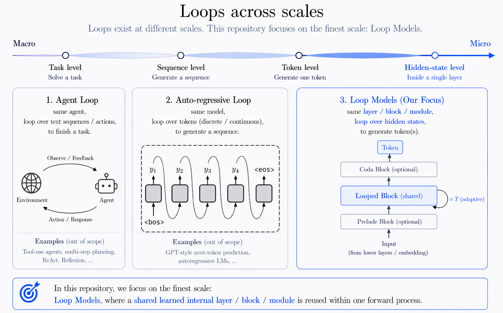

<div align="center">

# Awesome Loop Models

**Models that compute by looping: one learned layer, block, or operator, reused inside a single forward pass.**

[](https://awesome.re)
[](https://huskydoge.github.io/Awesome-Loop-Models/index.html)
[](https://huskydoge.github.io/Awesome-Loop-Models/submit.html)
[](https://opensource.org/licenses/MIT)


### 🌐 [**Interactive Browser**](https://huskydoge.github.io/Awesome-Loop-Models/index.html) · 🧾 [**PR Submission Guide**](https://huskydoge.github.io/Awesome-Loop-Models/submit.html)

<sub>The full catalog lives in the browser: search, filter by loop mechanism and domain, and read TL;DRs, venues, code links, and daily briefings.</sub>

</div>

## What is a loop model?

> Within a single forward pass, a shared learned layer, block, module, or operator is reused.

That covers looped, recurrent-depth, and weight-tied Transformers, adaptive halting over a reused block, deep-equilibrium and implicit layers, and shared neural algorithmic processors, plus theory and analysis of all of these. It leaves out agent loops, repeated full-model calls, diffusion-style iterative inference, and plain recurrence over time steps. [TAXONOMY.md](TAXONOMY.md) has the full rules.

<details>
<summary>Where the scope boundary sits</summary>
<br>


Only the rightmost end of this scale is in scope. Omitting `catalog_fit` means strict scope; the rare exceptions kept for context set `catalog_fit: adjacent` and are labeled **Adjacent work**.
</details>

<details>
<summary>How the catalog is organized</summary>
<br>

| Axis | Values |
|:--|:--|
| **Category** | Theoretical and Mechanical Analysis · Architecture and Algorithm Designs · Applications Focused |
| **Loop Mechanism** (`mechanism_tags`) | `flat-loop` · `hierarchical-loop` · `parallel-loop` · `implicit-layer` |
| **Focus** (`focus_tags`) | `architecture` · `training-algorithm` · `inference-algorithm` · `objective-loss` · `data` |
| **Domain** (`domain_tags`) | `language-modeling`, `reasoning`, `vision`, `graph-data`, … |

A paper can also carry a `foundation` badge when it is a canonical anchor such as ACT, Universal Transformers, or DEQ. The browser filters by Loop Mechanism, focus, and domain tags. Blogs sit in one flat section outside the paper categories. [TAGS.md](TAGS.md) lists every tag in use.
</details>

<!-- AUTO-GENERATED by scripts/build.py on 2026-09-29 22:35 UTC — DO NOT EDIT the sections below manually. Edit papers/*.yaml or blogs/*.yaml and run `python3 scripts/build.py` instead. -->

## At a glance

<p align="center"><b>249 papers</b> · 58 analysis · 159 designs · 32 applications · <b>8 blogs</b> · <a href="https://huskydoge.github.io/Awesome-Loop-Models/index.html">browse all →</a></p>

## 🌟 Start here

The foundational papers, plus the ones the maintainer marks as must-read.

| Paper | Venue | Loop | Links |
|:--|:--|:--|:--|
| <b>Adaptive Computation Time for Recurrent Neural Networks</b> | 2016 | flat-loop | <a href="https://arxiv.org/abs/1603.08983">arXiv</a> |
| <b>Universal Transformers</b> | ICLR 2019 | flat-loop | <a href="https://arxiv.org/abs/1807.03819">arXiv</a> |
| <b>Deep Equilibrium Models</b> | NeurIPS 2019 | implicit-layer | <a href="https://arxiv.org/abs/1909.01377">arXiv</a> · <a href="https://github.com/locuslab/deq">Code ★808</a> |
| 🌟 <b>Scaling up Test-Time Compute with Latent Reasoning: A Recurrent Depth Approach</b> | NeurIPS 2025 | flat-loop | <a href="https://arxiv.org/abs/2502.05171">arXiv</a> · <a href="https://github.com/seal-rg/recurrent-pretraining">Code ★972</a> · <a href="https://huggingface.co/tomg-group-umd/huginn-0125">HF</a> |
| 🌟 <b>Scaling Latent Reasoning via Looped Language Models</b> | 2025 | flat-loop | <a href="https://arxiv.org/abs/2510.25741">arXiv</a> · <a href="https://huggingface.co/ByteDance/Ouro-1.4B">HF</a> · <a href="https://ouro-llm.github.io/">Project</a> |
| 🌟 <b>Parcae: Scaling Laws For Stable Looped Language Models</b> | LIT Workshop @ ICLR 2026 | flat-loop | <a href="https://arxiv.org/abs/2604.12946">arXiv</a> |

## 🆕 Latest additions

| Added | Paper | Type | Links |
|:--|:--|:--|:--|
| 2026-09-28 | <b>Compute Time Scaling with Recursive Models for Combinatorial Optimization</b> | Application | <a href="https://arxiv.org/abs/2609.34585">arXiv</a> |
| 2026-09-28 | <b>FlexLoop: Depth-Elastic Looped Policies for Adaptive Test-Time Computation in Deep RL</b> | Design | <a href="https://arxiv.org/abs/2609.34488">arXiv</a> |
| 2026-09-28 | <b>How to Loop MoE: Flatten the Experts, Untie the Attention</b> | Design | <a href="https://arxiv.org/abs/2609.35751">arXiv</a> · <a href="https://github.com/SR-A-W/how-to-loop-moe">Code ★1</a> |
| 2026-09-28 | <b>Improving Test-Time Scaling with Adaptive Looped Transformers</b> | Design | <a href="https://arxiv.org/abs/2609.35748">arXiv</a> · <a href="https://github.com/thu-nics/TaH">Code ★91</a> |
| 2026-09-28 | <b>Loop Dropout: Regularizing Shared Updates in Looped Language Models</b> | Design | <a href="https://arxiv.org/abs/2609.34218">arXiv</a> |
| 2026-09-28 | <b>Multi-Attractor GNNs: Set-Valued Expressivity Beyond Unique Equilibria</b> | Analysis | <a href="https://arxiv.org/abs/2609.35274">arXiv</a> |
| 2026-09-28 | <b>Shallow Queries, Mature Values: Depth-Asynchronous Self-Speculation for Looped Transformers</b> | Design | <a href="https://arxiv.org/abs/2609.34538">arXiv</a> |
| 2026-09-28 | <b>Beyond the Training Horizon: Mechanisms and Limits of Length Generalization in Looped Transformers</b> | Analysis | <a href="https://arxiv.org/abs/2609.33144">arXiv</a> |
| 2026-09-28 | <b>LoopTrack: A Simple Baseline for Parameter-Efficient Transformer Tracking</b> | Application | <a href="https://arxiv.org/abs/2609.33306">arXiv</a> |
| 2026-09-28 | <b>Reasoning on the Simplex: Geometric Fixed-Point Models</b> | Design | <a href="https://arxiv.org/abs/2609.33540">arXiv</a> |

<sub>A daily watch adds new arXiv papers. The <a href="https://huskydoge.github.io/Awesome-Loop-Models/index.html">browser</a> has every paper and each day's briefing.</sub>

## 🔥 Most cited

| Paper | Venue | Citations | Links |
|:--|:--|:--|:--|
| <b>ALBERT: A Lite BERT for Self-supervised Learning of Language Representations</b> | ICLR 2020 | 7,723 | <a href="https://arxiv.org/abs/1909.11942">arXiv</a> · <a href="https://github.com/google-research/ALBERT">Code ★3,278</a> |
| <b>RAFT: Recurrent All-Pairs Field Transforms for Optical Flow</b> | ECCV 2020 | 4,225 | <a href="https://arxiv.org/abs/2003.12039">arXiv</a> · <a href="https://github.com/princeton-vl/RAFT">Code ★4,103</a> |
| <b>Deeply-Recursive Convolutional Network for Image Super-Resolution</b> | CVPR 2016 | 2,796 | <a href="https://arxiv.org/abs/1511.04491">arXiv</a> |
| <b>Universal Transformers</b> | ICLR 2019 | 1,061 | <a href="https://arxiv.org/abs/1807.03819">arXiv</a> |
| <b>Deep Equilibrium Models</b> | NeurIPS 2019 | 1,009 | <a href="https://arxiv.org/abs/1909.01377">arXiv</a> · <a href="https://github.com/locuslab/deq">Code ★808</a> |
| <b>Adaptive Computation Time for Recurrent Neural Networks</b> | 2016 | 857 | <a href="https://arxiv.org/abs/1603.08983">arXiv</a> |
| <b>Neural GPUs Learn Algorithms</b> | ICLR 2016 | 408 | <a href="https://arxiv.org/abs/1511.08228">arXiv</a> · <a href="https://github.com/openai/neural-gpu">Code ★144</a> |
| 🌟 <b>Scaling up Test-Time Compute with Latent Reasoning: A Recurrent Depth Approach</b> | NeurIPS 2025 | 382 | <a href="https://arxiv.org/abs/2502.05171">arXiv</a> · <a href="https://github.com/seal-rg/recurrent-pretraining">Code ★972</a> · <a href="https://huggingface.co/tomg-group-umd/huginn-0125">HF</a> |
| <b>Multiscale Deep Equilibrium Models</b> | NeurIPS 2020 | 269 | <a href="https://arxiv.org/abs/2006.08656">arXiv</a> · <a href="https://github.com/locuslab/mdeq">Code ★237</a> |
| <b>Looped Transformers as Programmable Computers</b> | ICML 2023 | 250 | <a href="https://arxiv.org/abs/2301.13196">arXiv</a> |

## ✍️ Blogs

Long-form technical posts on loop models.

| Date | Post | Where | Links |
|:--|:--|:--|:--|
| 2026-07-31 | <b>Towards Looped Models Done Right — Part I: Topology, Input Injection, Recurrent-State Design</b> | IFM Research | <a href="https://ifm-research.notion.site/Towards-Looped-Models-Done-Right-3ade511912ec8128987dfeb7a5580043">Read</a> |
| 2026-05-23 | <b>Rethinking Hierarchy in Iterative Reasoning Models</b> | X Article | <a href="https://x.com/huskydogewoof/status/2058082328744993013?s=20">Read</a> |
| 2026-04-29 | <b>Exact Input Writes Improve Stable Looped Language Models</b> | Personal Blog | <a href="https://huskydoge.github.io/husky-blog/posts/recursive_models/improve-parcae/">Read</a> · <a href="https://github.com/huskydoge/parcae-zoh-exact">Code</a> |
| 2026-04-21 | <b>Claude Mythos, Looped LLM, and the Depth Scaling Axis</b> | X Article | <a href="https://x.com/RidgerZhu/status/2046736781035618602">Read</a> |
| 2026-04-19 | <b>Loop-Model FLOPs and Memory in an Ablation Chain</b> | Personal Blog | <a href="https://huskydoge.github.io/husky-blog/posts/recursive_models/loop-cost/">Read</a> |
| 2026-04-19 | <b>On the Looped Transformers Controversy</b> | X Article | <a href="https://x.com/ChrisHayduk/status/2045947623572688943?s=20">Read</a> |
| 2026-01-12 | <b>Looped-GPT: Looping During Pre-training improves Generalization</b> | Personal Blog | <a href="https://sanyalsunny111.github.io/posts/2026-01-15-post1-looped-gpt/">Read</a> · <a href="https://github.com/sanyalsunny111/Looped-GPT">Code</a> |
| 2020-01-07 | <b>Adaptive Computation Time (ACT) in Neural Networks [3/3]</b> | Medium | <a href="https://moocaholic.medium.com/adaptive-computation-time-act-in-neural-networks-3-3-99452b2eff18">Read</a> |

## News

- **2026-07-17** — The browser gained a **Release Intelligence** view: publication pulse, long-term trends, and dossiers for the latest releases. [Explore stats](https://huskydoge.github.io/Awesome-Loop-Models/index.html#stats)
- **2026-04-24** — Awesome Loop Models is released. [Announcement](https://x.com/huskydogewoof/status/2047655947942744285)

## Contributing

Additions, corrections, and scope challenges are welcome. The [PR Submission Guide](https://huskydoge.github.io/Awesome-Loop-Models/submit.html) turns a paper or blog into generated YAML; add that file to `papers/` or `blogs/` in a branch in your fork and open a pull request. See [CONTRIBUTING.md](CONTRIBUTING.md), [TAXONOMY.md](TAXONOMY.md), and [TAGS.md](TAGS.md).

## Citation

```bibtex
@misc{huang2026awesomeloopmodels,
    title = {Awesome-Loop-Models},
    author = {Benhao Huang and {Awesome-Loop-Models Contributors}},
    journal = {GitHub repository},
    url = {https://github.com/huskydoge/Awesome-Loop-Models},
    year = {2026},
}
```

## Star History

<picture>
  <source media="(prefers-color-scheme: dark)" srcset="https://api.star-history.com/svg?repos=huskydoge%2Fawesome-loop-models&type=date&theme=dark">
  
</picture>

<div align="center">
<sub>
  Maintained by <a href="https://github.com/huskydoge">huskydoge</a> · generated from <code>papers/*.yaml</code> and <code>blogs/*.yaml</code> by <a href="scripts/build.py">scripts/build.py</a>
</sub>
</div>
